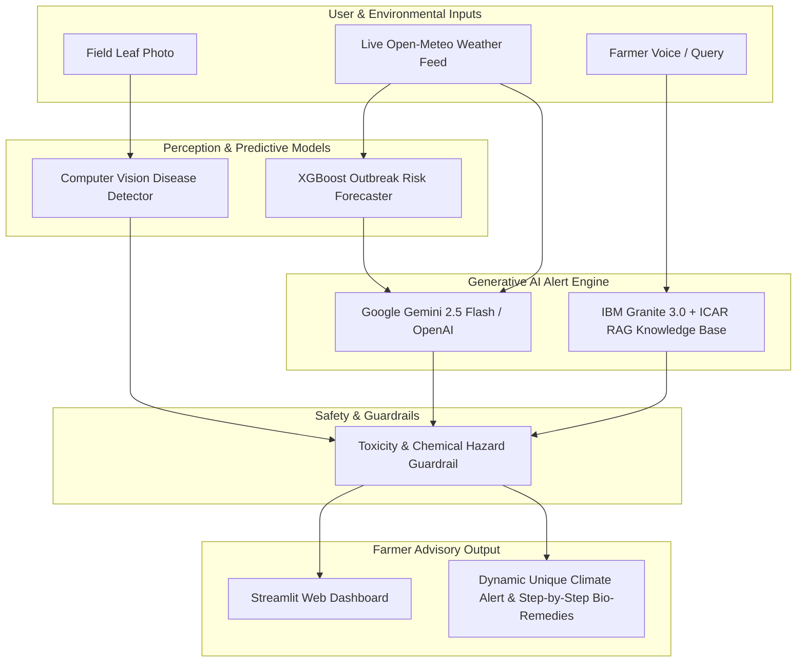

 KrishiMitra AI: Climate-Resilient Agricultural Advisory Copilot

[](https://www.python.org/)
[](https://streamlit.io/)
[](https://aistudio.google.com/)
[](https://xgboost.readthedocs.io/)
[](https://1m1b.org/)
[](https://sdgs.un.org/goals/goal2)
[](https://sdgs.un.org/goals/goal13)
[](https://sdgs.un.org/goals/goal15)

> **Virtual Internship Project** for **1M1B AI for Sustainability Virtual Internship** (In Collaboration with **IBM SkillsBuild & AICTE**).

---

## 📌 Project Context & Problem Statement

Smallholder farmers in developing nations face severe crop loss caused by sudden, unseasonal weather events (humidity spikes, unseasonal rainfall, heatwaves) which trigger rapid pest infestations and fungal diseases. Due to a lack of immediate scientific advisory, farmers often panic and dump hazardous chemical pesticides into their fields. This causes severe soil degradation, groundwater poisoning, and deep financial debt.

###  Official Problem Statement:
> *"How might we use AI to analyze local weather forecasts and crop symptoms so that smallholder farmers can take timely, eco-friendly pest prevention measures and make their farming practices more sustainable?"*

---

## 🌟 Key Features

1. **📡 Real-Time Microclimate Weather Integration (Open-Meteo)**:
   - Fetches live temperature, morning/evening humidity, precipitation, and rain probability for **any city or district in India** with **zero API keys required**.

2. **🌦️ Predictive ML Outbreak Risk Forecaster (XGBoost)**:
   - Evaluates microclimate variables to compute a pest outbreak probability index (0–100%) **up to 48 hours before visible crop damage**.

3. **✨ Dynamic AI Weather Alerts (Google Gemini & ChatGPT Support)**:
   - Uses **Google Gemini** / **ChatGPT** to dynamically synthesize **unique, date-and-weather-specific alerts** for each location instead of static templates.
   - Tells farmers whether to spray today, wait for rain to pass, or take proactive biological measures.

4. **🌿 Computer Vision Leaf Disease Scanner**:
   - Detects crop diseases (e.g., Tomato Early Blight, Paddy Blast, Leaf Curl) from leaf photos.
   - Highlights lesion areas with visual bounding boxes and maps them to certified **ICAR** bio-remedies.

5. **🤖 KrishiMitra Copilot (IBM Granite 3.0 + ICAR RAG)**:
   - Multilingual conversational assistant powered by **IBM Granite 3.0-8B Instruct** and **Retrieval-Augmented Generation (RAG)**.

6. **⚖️ Built-in Responsible AI Guardrails**:
   - Comprehensive evaluation of Fairness, Transparency, Ethics, and Privacy.

---

## 🏗️ System Architecture



---

## 💻 Tech Stack

| Component | Technology Used |
| :--- | :--- |
| **Frontend UI** | **Streamlit** (Python) |
| **Dynamic Alert Engine** | **Google Gemini API** (`gemini-2.5-flash`) & **OpenAI** (`gpt-4o-mini`) |
| **Foundation LLM (RAG)** | **IBM Granite 3.0** (`granite-3.0-8b-instruct`) |
| **Predictive ML** | **XGBoost Classifier**, Scikit-Learn |
| **Computer Vision** | PyTorch / PIL / OpenCV |
| **Real-time Weather** | Open-Meteo Satellite & Climate API (Free, zero API key) |
| **Knowledge Base** | ICAR (Indian Council of Agricultural Research) IPM Repository |

---

## 🚀 Quickstart: Running Locally

```bash
# 1. Clone the repository
git clone https://github.com/YOUR_USERNAME/krishimitra-ai.git
cd krishimitra-ai

# 2. Install dependencies
pip install -r requirements.txt

# 3. Launch the Streamlit application
streamlit run app.py
```

Open your browser and navigate to `http://localhost:8501`.

---

## 👥 Acknowledgments & Mentorship
* **1M1B (1 Million for 1 Billion)** Foundation
* **IBM SkillsBuild**
* **AICTE (All India Council for Technical Education)**
